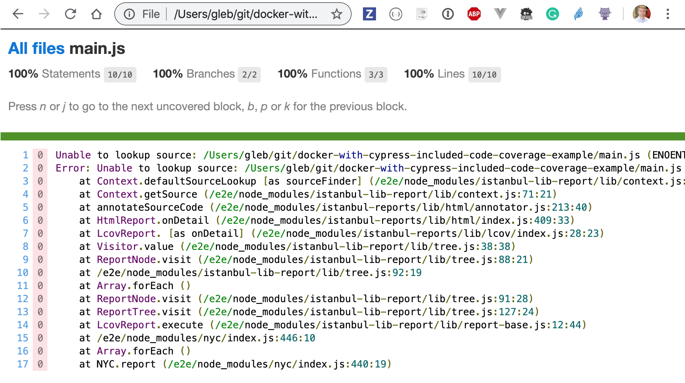

# docker-with-cypress-included-code-coverage-example

Cypress Docker images with Cypress pre-installed globally at [cypress-docker-images](https://github.com/cypress-io/cypress-docker-images/tree/master/included)

Adding coverage plugin

```sh
npm i -D @cypress/code-coverage@2.0.0-beta.2
```

Added support and task code following the instructions from the [cypress-io/code-coverage](https://github.com/cypress-io/code-coverage) plugin

Run tests inside a Docker container

```sh
$ ./run-cypress.sh
# or run with debug logs from the code coverage plugin
$ DEBUG=code-coverage ./run-cypress.sh
```

## Issues

- detailed HTML report is missing the file sources.



**Reason:** you have instrumented the source file locally, then ran the tests in the Docker container. The report is generated inside the container but the source file paths are all absolute paths on the local machine, and thus cannot be found.

Note that the summary numbers (number of lines, functions, branches covered) are still correct.

**Solution:** generate HTML report _after exiting_ from the container (yourself). Code coverage plugin has `nyc` as a dependency, so it should be available.

```sh
# generate HTML report
$ npx nyc report --reporter=lcov
# see just the coverage summary
$ npx nyc report --reporter=text-summary
# see just the coverage by file
$ npx nyc report --reporter=text
```
